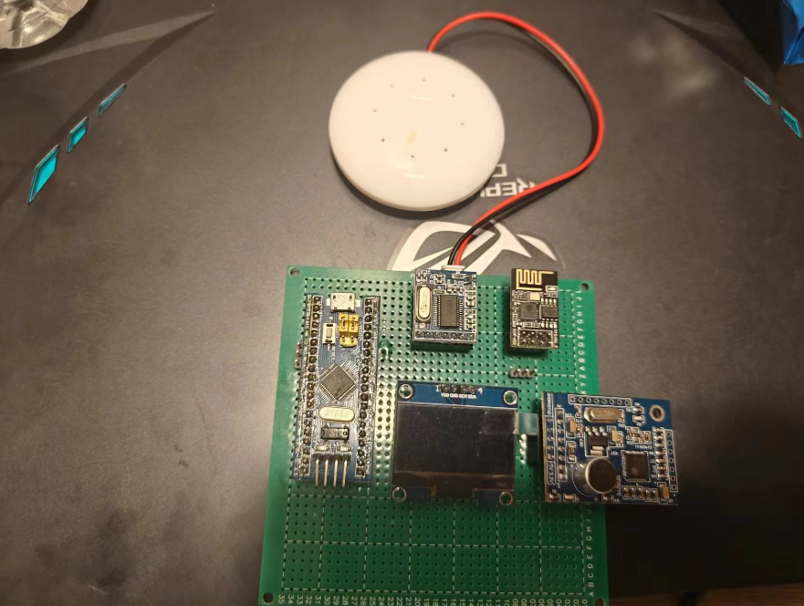
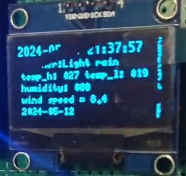
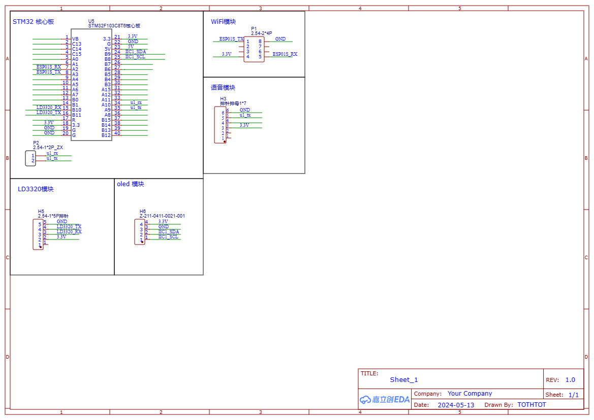
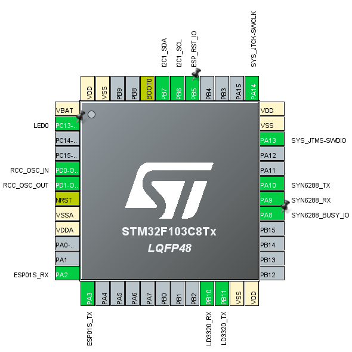

# 基于stm32的智能语音天气预报系统

## 使用材料

1.  主控: stm32f103c8t6
2. oled 显示屏
3. 语音识别模块: LD3320
4. 语音播报模块: syn6288
5. WiFi模块: esp-01s
6. 洞洞板

## 实现功能

- [x] stm32 通过 esp 获取天气数据并通过屏幕显示本地未来三天天气(今天明天后天)、当天温湿度、当天风速当天日历时间(精确到秒);

- [x] LD3320语音识别, 返回识别结果给 stm32 获得天气信息, 并通过 syn6288 播报;

## 实物图



## 使用方法

- 手机开启2.4G频段热点, 设置WiFi名称为 "esp-2.4G", 密码为 "12345678..";

- 插上电源, 设备进入初始化, 屏幕显示"statr init"以及版本信息;
  
  - 如果初始化失败就复位单片机再初始化;

- 启动成功如图所示, 最上方是时间信息, weather: 天气类型, temp_h: 最高温度, temp_l: 最低温度, humidity: 湿度, wind speed: 风速, 以及对应天气的日期;屏幕滚动显示近三天天气;



- 语音天气查询方式: 
  
  - 说 "小杰", 唤醒模块;
  
  - 说 "查询xxxx天气", 查询成功后会通过语音模块播报, 查询直辖市说"查询北京天气", 查询省会城市说"查询福建福州天气", 默认的显示城市天气数据为 `DEFAULT_CITY`指定的城市, 目前是`fujianfuzhou`;
  
  - 具体支持哪些城市查看`./code/LD3320/code/LDChip.c`内的`uint8 code sRecog`数组;

- null

## 目录

```c
D:.
├─code // 代码存放目录
│  ├─LD3320 // ld3320 代码
│  └─STM32F103C8T6(HAL+FreeRTOS) // stm32 代码
└─images // 图片
```

## 原理图



## 单片机引脚分配


